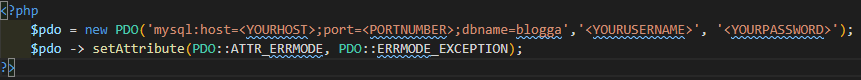

<h1>Tesla CRUD App</h1>

**This is a CRUD application I made a few years ago. It uses PHP on the backend and a MySQL database to store the data. The user can register/login and then CRUD data rendered to the main page.   To use the app run clone this repo using git clone https://github.com/HarryH-Tech/Tesla_CRUD. Then import the favorites.sql table into a MySQL database called "tesla_registration" in phpMyAdmin.  You'll then have to create a pdo.php file in the favorites directory and fil it in using the same configuration as below except replacing the host, port number, username and password to suit your MySQL configuration.   You can then navigate to http://localhost/Tesla_CRUD/index.php to view the website.**

